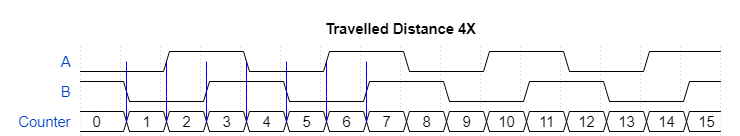
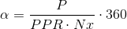

# Rotary Encoder #

This is a reference implementation for reading a rotary encoder. A rotary encoder is a device that allows to measure the angular rotation of its shaft as well as the direction of rotation. It outputs two signals, to which we will refer throughout the text as A and B. These two signals are shifted by 90 degrees which is why rotary encoders are also called "quadrature encoders". There are rotary encoders meant for human operation, for instance a control knob on a device front panel, and others that are meant to detect speed and direction of rotation of motors or any turning shaft for that matter. The ones meant for human opeation have quite marked detents to give tactile feedback.

## Angular Distance ##

As you can see in the timing diagram below, if we are interested only in knowing the angular distance travelled by the shaft, we can just count the pulses on one of the two channels. Rotary encoders specs always include a number of Pulses Per Revolution (PPR), so we can know how many degrees the shaft has travelled. For instance an encoder with 20 PPR will have travelled 180 degrees after 10 rising edges of A.

In other words a rotary encoder with 20 PPR has a resolution of 18 degrees per pulse. We could though double this resolution by detecting both the raising and falling edges of A. As seen below we get the counter incrementing on both edges which gives us a resolution of 6 degrees. This mode is usually referred to a 2X. Note that this mode (as well as 4X introduced below) are only different ways to decode the signal, they are not a characteristic of the encoder per se. Any quadrature encoder can be read in 1x, 2x or 4x mode.

If we add the B signal into the equation and count on both rising and falling edges of A and B we can increase the resolution by a factor of 4. So our 20 PPR encoder can be read with a resolution of 3 degrees. The timing diagram below shows the 4x decoding mode.

In general the travelled angular distance can be expressed as:

Where P is the counted pulses (edges of the signal), PPR is the Pulses Per Revolution and Nx is the multiplier factor given by the decoding mode (1, 2, 4).

## Why don't we just use 4x? ##

Since the 4x mode gives higher resolution it might appear this is the only mode in which an encoder should be read. There are reasons though to use the other modes as well. In some cases, more rare though nowadays where microcontrollers are in pretty much every project, simplicity of hardware is one factor. You can simply hook up the A signal to a the clock of a counter, in which case you would be reading in 1x. For applications geared towards human interaction another important factor is the amount of detents versus PPR. For instance an encoder could have 30 detents and 15 PPR. If read in 1x mode it could result rather annoying as it requires to travel through two detents for an action to be taken (think, for instance, moving to the next entry on a menu), 2x would be the appropriate choice in this case. 4x would be completely out of the question as there would be an action between detents meaning you would be to set a specific item in the manu enties list.

Additionally increasing resolution does not equate to increasing precision, by reading an encoder in 4x mode also the errors are mutiplied by the same factor so, in practice, the accuracy is the same.

## Direction of travel ##

The second interesting characteristic of quadrature encoders is that they allow to detect in which direction the shaft is rotating. To understand how this is achieved see the timing diagram below which, we will assume, is representative of the signals when the shaft is travelling clockwise.

Notice how B is always *low* on the rising edge of A. If you now follow the above diagram in the opposite direction, reading it from right to left, which is what would happen if you turned the shaft counter-clockwise. You will see that B will always be *high* on the rising edges of A, this is becasue, effectively, the falling edges of A have become the rising ones. The timing diagram below shows the signals when the encoder is turning counter-clockwise.

So, simply by reading the value of B on the rising edge of A we can determine the direction of rotation. You can see an example of this in `Encode1x.ino` where an interrupt is attacched to the A signal rising edge. When the interrupt triggers the ISR we count one event determing the direction of travel by reading B.

