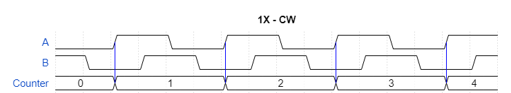
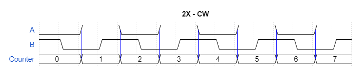
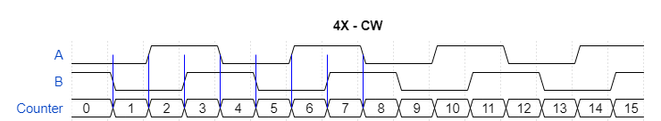

# Rotary Encoder #

This is a reference implementation for reading a rotary encoder. A rotary encoder is a device that allows to measure the angular rotation of its shaft as well as the direction of rotation. It outputs two signals, to which we will refer throughout the text as A and B. These two signals are shifted by 90 degrees which is why rotary encoders are also called "quadrature encoders". There are rotary encoders meant for human operation, for instance a control knob on a device front panel, and others that are meant to detect speed and direction of rotation of motors or any turning shaft for that matter. The ones meant for human opeation have quite marked detents to give tactile feedback.

## Angular Distance ##

As you can see in the timing diagram below

