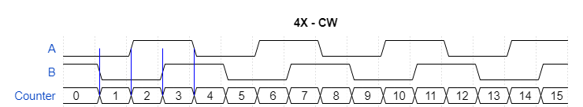

**Note**: this is implemented as an Arduino library because I use it in other projects of mine that build on this concept, however this is far from being a higly polished library as it's more of a study item to get familiar with operation of rotary encoders. If you are looking for a library to use in your project I would recommend looking elsewhere, for instance https://github.com/PaulStoffregen/Encoder

# Rotary Encoders #

A rotary encoder is a device that allows to measure the angular rotation of its shaft as well as the direction of rotation. It outputs two signals, to which we will refer throughout the text as A and B. These two signals are shifted by 90 degrees which is why rotary encoders are also called "quadrature encoders". There are rotary encoders meant for human operation, for instance a control knob on a device front panel, and others that are meant to detect speed and direction of rotation of motors or any turning shaft for that matter. The ones meant for human opeation have quite marked detents to give tactile feedback.

## Angular Distance ##

As you can see in the timing diagram below, if we are interested only in knowing the angular distance travelled by the shaft, we can just count the pulses on one of the two channels. Rotary encoders specs always include a number of Pulses Per Revolution (PPR), so we can know how many degrees the shaft has travelled. For instance an encoder with 20 PPR will have travelled 180 degrees after 10 rising edges of A.


In other words a rotary encoder with 20 PPR has a resolution of 18 degrees per pulse. We could though double this resolution by detecting both the raising and falling edges of A. As seen below we get the counter incrementing on both edges which gives us a resolution of 6 degrees. This mode is usually referred to a 2X. Note that this mode (as well as 4X introduced below) are only different ways to decode the signal, they are not a characteristic of the encoder per se. Any quadrature encoder can be read in 1x, 2x or 4x mode.


If we add the B signal into the equation and count on both rising and falling edges of A and B we can increase the resolution by a factor of 4. So our 20 PPR encoder can be read with a resolution of 3 degrees. The timing diagram below shows the 4x decoding mode.


In general the travelled angular distance can be expressed as:


Where P is the counted pulses (edges of the signal), PPR is the Pulses Per Revolution and Nx is the multiplier factor given by the decoding mode (1, 2, 4).

## Why don't we just use 4x? ##

Since the 4x mode gives higher resolution it might appear this is the only mode in which an encoder should be read. There are reasons though to use the other modes as well. In some cases, more rare though nowadays where microcontrollers are in pretty much every project, simplicity of hardware is one factor. You can simply hook up the A signal to a the clock of a counter, in which case you would be reading in 1x. If you use an up/down counter hooking up A to the clock and B to the up/down control would give you control in both directions, also in 1x. 

For applications geared towards human interaction another important factor is the amount of detents versus PPR. For instance an encoder could have 30 detents and 15 PPR. If read in 1x mode it could result rather annoying as it requires to travel through two detents for an action to be taken (think, for instance, moving to the next entry on a menu), 2x would be the appropriate choice in this case. 4x would be completely out of question as there would be an action between detents meaning you would not be to set a specific item in the manu enties list.

Additionally increasing resolution does not equate to increasing precision, by reading an encoder in 4x mode also the errors are mutiplied by the same factor so, in practice, the accuracy is the same.

## Direction of travel ##

The second interesting characteristic of quadrature encoders is that they allow to detect in which direction the shaft is rotating. To understand how this is achieved see the timing diagram below which, we will assume, is representative of the signals when the shaft is travelling clockwise.


Notice how B is always *low* on the rising edge of A. If you now follow the above diagram in the opposite direction, reading it from right to left, which is what would happen if you turned the shaft counter-clockwise, you will see that B will always be *high* on the rising edges of A, this is becasue, effectively, the falling edges of A have become the rising ones. The timing diagram below shows the signals when the encoder is turning counter-clockwise.


So, simply by reading the value of B on the rising edge of A we can determine the direction of rotation. You can see an example of this in `RotaryEncoder.cpp` where we determine the direction by reading B on a rising edge of A:

```
void RotaryEncoder::processABChange1X(uint8_t changeA, uint8_t changeB)
{
    if (changeA == __ROTARY_ENCODER_RISE)
    {
        this->processRotationStep(digitalRead(this->pinB) == LOW);
    }
}
```

When doing 2x decoding we will need to determine the direction of travel by looking at B, as above, for the rising edge and the B negated on the falling edge, as should become apparent from the timing diagram below. You can see an example of this in `RotaryEncoder.cpp`:

```
void RotaryEncoder::processABChange2X(uint8_t changeA, uint8_t changeB)
{
    if (changeA != __ROTARY_ENCODER_NOCHANGE)
    {
        this->processRotationStep(changeA == __ROTARY_ENCODER_RISE ? digitalRead(this->pinB) == LOW : digitalRead(this->pinB) == HIGH);
    }
}
```


Finally, 4x decoding is just one more step forward from the above progression. We will need to determine the rotation based on B values on A edges and on A values on B edges. You can see an example of this in `RotaryEncoder.cpp`:

```
void RotaryEncoder::processABChange4X(uint8_t changeA, uint8_t changeB)
{
    if (changeA != __ROTARY_ENCODER_NOCHANGE)
    {
        this->processRotationStep(changeA == __ROTARY_ENCODER_RISE ? digitalRead(this->pinB) == LOW : digitalRead(this->pinB) == HIGH);
    }

    if (changeB != __ROTARY_ENCODER_NOCHANGE)
    {
        this->processRotationStep(changeB == __ROTARY_ENCODER_RISE ? digitalRead(this->pinA) == HIGH : digitalRead(this->pinA) == LOW);
    }
}
```



## Application in human interfaces ##

Depending on the application, expecially when dealing with human interfaces, further considerations might apply. For instance assume you are controlling a menu selection where items are selected by turning the knob on the encoder. In this case it's mandatory that at each detent the selection moves by one entry. Anything else would feel awkward or plainly unusable (think a move of 2 items per detent!). This limits the selection of the encoder to one where the detents to PPR ratio is either 1, 2 or 4. You will then need to read in the appropriate mode to achieve one action per detent.

Consider instead an application where the knob is used to adjust a value with a relatively large dynamic range, for instance 0 to 200 as in the example code. Making large changes with an increment of 1 per detent would be incredibly annoying as it would take a long time. On the other hand, if the requirement is to be able to asjust the value with a unit resolution, increasing the increment per detent wouldn't be an option. It's at this point that we need to consider another dimension, which is the speed of rotation. We generally assume that when making fast adjustments a human  wouldn't make precise ones and, conversely, when making precise adjustments a human would move the control more slowly. On this premise we can then move in larger steps when the control is being handled at higer speeds. Since, usually, it's easier to measure time intevals we can just invert the relation and save our code from performing time consuming (in the realm of small microcontrollers), we can then say that we need to use smaller increments as the time interval between detents increases.


The graph above refers to the curve I have used in my code, see `RotaryEncoder.cpp`:

```
unsigned int RotaryEncoder::getPositionIncrement()
{
    if (this->positionChangeMode == ROTARY_ENCODER_MODE_LINEAR)
    {
        return 1;
    }

    unsigned int factor = max(1, (20 - (signed long)(millis() - this->lastPositionChangeTime)) >> 2);
    this->lastPositionChangeTime = millis();

    return factor;
}
```

By no means this is a hard curve suitable for all applications. The number of detents per revolution of your encoder, the dynamic range but also phyical elements such as the diameter of the knob will affect what feels better in practical usage. The curve I used is `y=(20-x)/4` clipped at 1 on the lower bound. Also, in the interest of avoiding divisions, the division by 4 is done by shifiting right by 2.
        

## Click Button ##

While not strictly realted to rotaty encoders a couple of notes regarding the click button are in place. Rotary encoders meant for human interfaces can have a push button integrated, this combination can be used to create single control intefaces which allow for navigation of menus and set of values. I included in the library detection of both a short and a long presses.  

The first item of interest is the debouncing of the switch. Since this is a push button there will be chatter and, since the code code depends on measuring for how long the button is pressed, we need to make sure that bouncing has stopped. The code does that by implementing a buffer, initialised to 0x55 (binary B01010101). Subsequent reads of the switch are pushed into the lsb rotating the  buffer left.

```
byte debounce = 0x55;
while (debounce != 0x00)
{
    debounce = (debounce << 1) | (digitalRead(this->pinSW) & 1);
    delay(1);
}
```

The loop continues until the buffer contains all zeros, indicating 8 consecutive zero readings have been taken. There's nothing too magic about the value 0x55, in this case 0x01 would do just as well (0x80 clearly not as it would be enough for the first read to be 0 to exit the loop). Being 0x55 and alternation of 0s and 1s it's a good start value whether you are debouncing a switch that is holding an input to zero or to one.

The next bit is a loop that will either timeout, after 500mS or exit if the button is releasead. This allows to react immediately to button release, which is expected, but also gives an immediate feedback to a user performing a long press when he keeps it pressed long enough. 

```
unsigned long initialTime = millis();
while ((millis() - initialTime < 500) && digitalRead(this->pinSW) == 0)
{
    delay(1);
}
```

A more naive implementation that just waits for the button to be released and then times the duration of the press would leave the user wondering whether he pressed the button long enough.

From here the rest should be pretty much self explanatory, action is taken based on the type of press and the function waits for the button to be released before exiting to avoid unwanted re-entry.

## The Hardware ##

Below is the wiring diagram for the test hardware I used to verify the code. Some rotary encoders contain already the switch, I presented here a separate component for better clarity and, to be honest, for lack of a ready component in Fritzing or, should I say, for lack of motivation to create one &#128517;. 


