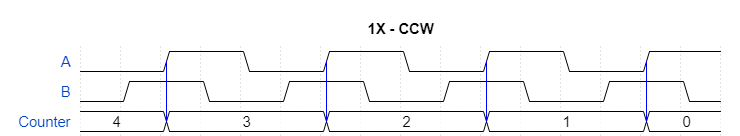

# Rotary Encoder #

This is a reference implementation for reading a rotary encoder. A rotary encoder is a device that allows to measure the angular rotation of its shaft as well as the direction of rotation. It outputs two signals, to which we will refer throughout the text as A and B. These two signals are shifted by 90 degrees which is why rotary encoders are also called "quadrature encoders". There are rotary encoders meant for human operation, for instance a control knob on a device front panel, and others that are meant to detect speed and direction of rotation of motors or any turning shaft for that matter. The ones meant for human opeation have quite marked detents to give tactile feedback.

## Angular Distance ##

As you can see in the timing diagram below, if we are interested only in knowing the angular distance travelled by the shaft, we can just count the pulses on one of the two channels. Rotary encoders specs always include a number of Pulses Per Revolution (PPR), so we can know how many degrees the shaft has travelled. For instance an encoder with 20 PPR will have travelled 180 degrees after 10 rising edges of A.

In other words a rotary encoder with 20 PPR has a resolution of 18 degrees per pulse. We could though double this resolution by detecting both the raising and falling edges of A. As seen below we get the counter incrementing on both edges which gives us a resolution of 6 degrees. This mode is usually referred to a 2X. Note that this mode (as well as 4X introduced below) are only different ways to decode the signal, they are not a characteristic of the encoder per se. Any quadrature encoder can be read in 1x, 2x or 4x mode.

